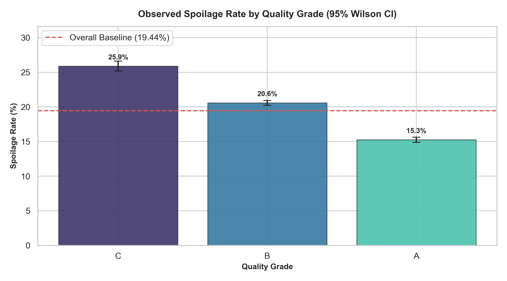
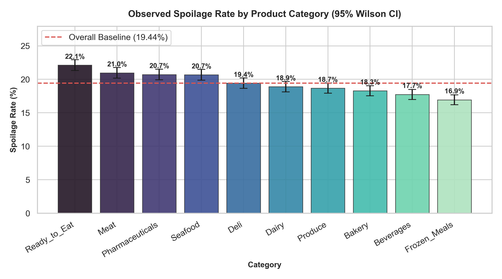
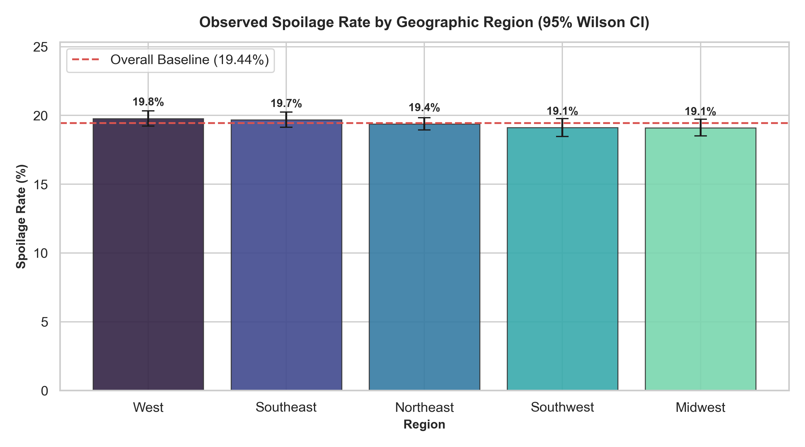
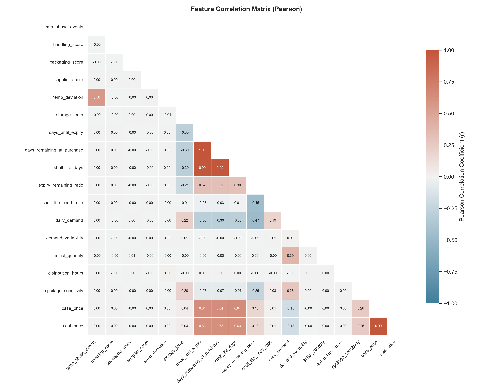
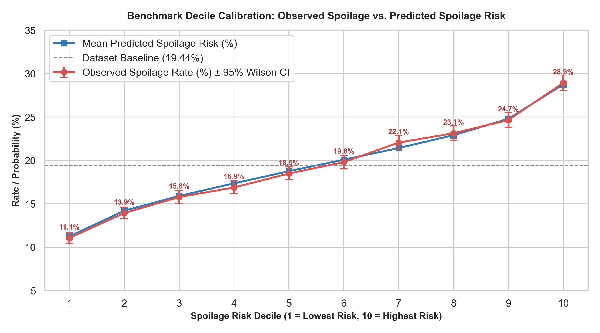
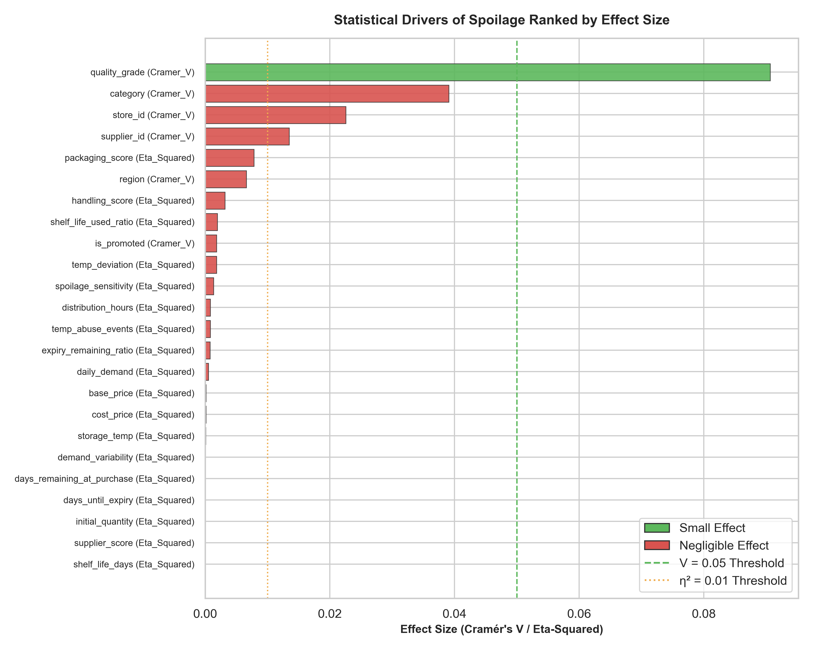

# Task M2-T01: Statistical Analysis of Spoilage Drivers
**Project:** Smart Shelf — Perishable Food Waste Reduction and Dynamic Markdown Optimizer  
**Deliverable:** Statistical Spoilage Drivers & Factor Analysis Report  
**Author / Team:** NHA-5-150 Data Science Team  
**Dataset Analyzed:** `processed/cleaned_dataset.csv` (100,000 transactions, 57 features, zero missing values)  
**Execution Companion:** [`notebooks/M2_T01_statistical_analysis.ipynb`](../notebooks/M2_T01_statistical_analysis.ipynb)  
**Module Code:** [`src/m2_t01_analysis.py`](../src/m2_t01_analysis.py)  

---

## Executive Summary

This report delivers a rigorous, end-to-end statistical evaluation of all candidate pre-sale factors associated with supermarket perishable food spoilage (`was_spoiled`, binary target, baseline rate **19.442%**). The objective is to identify statistically verified, causally sound predictors for the Milestone 3 Track 3A Spoilage Risk Classifier, while identifying noise, extreme multicollinearity, and reverse-causality artifacts.

### Key Empirical Findings:
1. **`quality_grade` is the Single Meaningful Categorical Driver:**  
   Quality grade exhibits a strong, statistically verified association with spoilage ($\chi^2 = 821.74, p_{\text{adj}} = 8.73 \times 10^{-178}$, Cramér's $V = 0.0906$). Spoilage rates rise from **15.25%** for Grade A to **20.59%** for Grade B, reaching **25.89%** for Grade C (a 10.64 percentage-point span).
2. **`category` Has a Statistically Detectable but Practically Negligible Association:**  
   Across the 10 product categories, spoilage rates range from **16.94%** (Frozen Meals) to **22.11%** (Ready to Eat). While the Chi-Square test rejects the null due to sample size ($\chi^2 = 152.97, p_{\text{adj}} = 3.85 \times 10^{-27}$), Cramér's $V = 0.0391 < 0.05$ indicates a negligible practical effect. It is retained in modeling as an operational control.
3. **`region`, `store_id`, `supplier_id`, and `is_promoted` Are Pure Noise:**  
   Geographic region fails to reject independence ($\chi^2 = 4.39, p = 0.3556, p_{\text{adj}} = 1.0$, Cramér's $V = 0.0066$), with spoilage rates hovering between **19.10%** and **19.78%** across all five regions. Store ID ($p_{\text{adj}} = 1.0$), Supplier ID ($p_{\text{adj}} = 1.0$), and Promotion status ($p_{\text{adj}} = 1.0$) also carry no measurable relationship with spoilage and should be omitted from spoilage risk classifiers.
4. **Physical Handling & Packaging Quality Are the Primary Numeric Drivers:**  
   `packaging_score` ($r_{\text{pb}} = -0.0885$, Welch $t = -28.29, p_{\text{adj}} = 2.30 \times 10^{-172}$, Cohen's $d = -0.2245$) and `handling_score` ($r_{\text{pb}} = -0.0563$, Student $t = -17.90, p_{\text{adj}} = 1.08 \times 10^{-69}$, Cohen's $d = -0.1425$) are the top numeric correlates. Poor packaging and rough transit handling substantially increase spoilage probability.
5. **Extreme Multicollinearity Mandates Feature Pruning:**  
   `days_until_expiry`, `days_remaining_at_purchase`, and `shelf_life_days` are virtually identical ($r > 0.991$, Variance Inflation Factor $\text{VIF} > 20,000$). `days_remaining_at_purchase` and `shelf_life_days` must be dropped, retaining `days_until_expiry`. Similarly, `cost_price` ($r = 0.986$, $\text{VIF} \approx 36$ with `base_price`) must be dropped. `spoilage_sensitivity` is strictly constant within categories (9 unique values) and is redundant with category.
6. **Synthetic Dataset Diagnostic Calibration:**  
   In the synthetic data generation process, observed spoilage behaves like a probabilistic draw from `spoilage_risk` ($r = 0.1308$). Across `spoilage_risk` deciles, observed spoilage rises monotonically from **11.07%** (Decile 1) to **28.94%** (Decile 10). Linear correlations of individual features top out near $|r| \approx 0.09$, establishing that Track 3A modeling must prioritize non-linear interactions and probability calibration.

---

## 1. Data Governance & Leakage Prevention Boundaries

In compliance with Milestone 1 architectural contracts and strict project rules, the following leakage constraints were strictly enforced:

| Governance Rule | Implementation in M2-T01 | Rationale & Protection |
| :--- | :--- | :--- |
| **Strict Exclusion of `spoilage_risk`** | Removed from all feature testing, correlation rankings, and classifier inputs. Evaluated solely in Section 6 as a diagnostic benchmark. | `spoilage_risk` is an endogenous ground-truth generation parameter. Using it as a model input would constitute direct label leakage. |
| **Exclusion of Post-Sale Outcome Columns** | Excluded `units_sold`, `units_wasted`, `waste_pct`, `revenue`, `waste_cost`, `profit`, and `profit_margin_pct`. | These variables are realized only *after* the sales period concludes. Including them would introduce future lookahead bias. |
| **Descriptive-Only Treatment of Discounts** | `discount_pct`, `markdown_applied`, and `selling_price` analyzed purely descriptively; omitted from pre-sale predictor candidate pool. | `markdown_applied == (discount_pct > 0)` in 100% of rows. Discount depth correlates positively with spoilage ($r = +0.0466$) due to *reverse causality* (managers markdown aging inventory). In Track 3A, discounts are excluded to prevent treatment contamination; in Track 3B, discount is the treatment variable. |
| **Pre-Sale Accounting Identity** | Verified `initial_quantity == units_sold + units_wasted` in 100.0% of rows (0 max deviation). | `initial_quantity` represents the initial batch size, a legitimate pre-sale stock proxy. |
| **Dual Shelf-Life Metric Preservation** | Evaluated both `expiry_remaining_ratio` and `shelf_life_used_ratio` independently without merging. | They correlate at only $r = -0.4533$. `expiry_remaining_ratio` measures physical expiration buffer; `shelf_life_used_ratio` measures elapsed transit/storage time. |
| **Random Seed Fixation** | `RANDOM_STATE = 42` enforced across all permutation tests and Mutual Information calculations. | Guarantees exact reproducibility across all environments. |

---

## 2. Categorical Drivers of Spoilage (Step 1)

### 2.1 Pearson Chi-Square Tests of Independence
For each categorical factor, cross-tabulation with `was_spoiled` yielded the following test statistics. All cells satisfied Cochran's criterion ($\min(E_{ij}) \ge 5.0$).

*Data source: [`reports/tables/chi_square_results.csv`](tables/chi_square_results.csv)*

| Factor | Test Used | $\chi^2$ Statistic | $dof$ | Raw $p$-Value | Adjusted $p$ (Holm) | Cramér's $V$ | Min Expected Count | Cochran Assumption |
| :--- | :--- | :---: | :---: | :---: | :---: | :---: | :---: | :---: |
| **`quality_grade`** | Chi-Square | **821.74** | 2 | $3.64 \times 10^{-179}$ | **$8.73 \times 10^{-178}$** | **0.0906** | 2,779.8 | Met ($\ge 5$) |
| **`category`** | Chi-Square | **152.97** | 9 | $2.14 \times 10^{-28}$ | **$3.85 \times 10^{-27}$** | **0.0391** | 1,924.9 | Met ($\ge 5$) |
| **`store_id`** | Chi-Square | 50.90 | 49 | 0.3987 | 1.0000 | 0.0226 | 364.9 | Met ($\ge 5$) |
| **`supplier_id`** | Chi-Square | 18.19 | 19 | 0.5096 | 1.0000 | 0.0135 | 953.6 | Met ($\ge 5$) |
| **`region`** | Chi-Square | 4.39 | 4 | 0.3556 | 1.0000 | 0.0066 | 2,728.5 | Met ($\ge 5$) |
| **`is_promoted`** | Chi-Square | 0.34 | 1 | 0.5591 | 1.0000 | 0.0018 | 2,896.5 | Met ($\ge 5$) |

### 2.2 Deep Dive: Quality Grade
Quality grade exhibits a strong, monotonic gradient in spoilage risk. High-grade batches undergo superior handling and packaging, whereas Grade C batches experience elevated failure rates.

*Data source: [`reports/tables/spoilage_rate_by_quality_grade.csv`](tables/spoilage_rate_by_quality_grade.csv)*

| Quality Grade | Total Batches | Spoiled Batches | Spoilage Rate (%) | 95% Wilson CI Lower (%) | 95% Wilson CI Upper (%) | Half-Width ($\pm\%$) |
| :---: | :---: | :---: | :---: | :---: | :---: | :---: |
| **C** | 14,298 | 3,702 | **25.89%** | 25.18% | 26.62% | $\pm 0.72\%$ |
| **B** | 50,037 | 10,301 | **20.59%** | 20.23% | 20.94% | $\pm 0.35\%$ |
| **A** | 35,665 | 5,439 | **15.25%** | 14.88% | 15.63% | $\pm 0.37\%$ |

### 2.3 Deep Dive: Product Category
Product categories display modest variance in spoilage rate, with Ready-to-Eat and Meat showing the highest risk, and Frozen Meals and Beverages showing the lowest.

*Data source: [`reports/tables/spoilage_rate_by_category.csv`](tables/spoilage_rate_by_category.csv)*

| Category | Total Batches | Spoiled Batches | Spoilage Rate (%) | 95% Wilson CI Lower (%) | 95% Wilson CI Upper (%) | Half-Width ($\pm\%$) |
| :--- | :---: | :---: | :---: | :---: | :---: | :---: |
| **Ready_to_Eat** | 10,049 | 2,222 | **22.11%** | 21.31% | 22.93% | $\pm 0.81\%$ |
| **Meat** | 10,055 | 2,107 | **20.95%** | 20.17% | 21.76% | $\pm 0.80\%$ |
| **Pharmaceuticals** | 10,120 | 2,095 | **20.70%** | 19.92% | 21.50% | $\pm 0.79\%$ |
| **Seafood** | 9,957 | 2,058 | **20.67%** | 19.88% | 21.48% | $\pm 0.80\%$ |
| **Deli** | 9,991 | 1,940 | **19.42%** | 18.65% | 20.20% | $\pm 0.78\%$ |
| **Dairy** | 9,964 | 1,882 | **18.89%** | 18.13% | 19.67% | $\pm 0.77\%$ |
| **Produce** | 10,001 | 1,867 | **18.67%** | 17.92% | 19.44% | $\pm 0.76\%$ |
| **Bakery** | 10,039 | 1,835 | **18.28%** | 17.53% | 19.05% | $\pm 0.76\%$ |
| **Beverages** | 9,901 | 1,755 | **17.73%** | 16.99% | 18.49% | $\pm 0.75\%$ |
| **Frozen_Meals** | 9,923 | 1,681 | **16.94%** | 16.22% | 17.69% | $\pm 0.74\%$ |

### 2.4 Deep Dive: Geographic Region
Across all 5 geographic regions, spoilage rates are virtually flat (spanning less than 0.68 percentage points). The Chi-Square test confirms that geographic region has no statistically or practically significant association with spoilage.

*Data source: [`reports/tables/spoilage_rate_by_region.csv`](tables/spoilage_rate_by_region.csv)*

| Region | Total Batches | Spoiled Batches | Spoilage Rate (%) | 95% Wilson CI Lower (%) | 95% Wilson CI Upper (%) | Half-Width ($\pm\%$) |
| :--- | :---: | :---: | :---: | :---: | :---: | :---: |
| **West** | 19,945 | 3,945 | **19.78%** | 19.23% | 20.34% | $\pm 0.55\%$ |
| **Southeast** | 20,104 | 3,958 | **19.69%** | 19.14% | 20.24% | $\pm 0.55\%$ |
| **Northeast** | 29,926 | 5,801 | **19.38%** | 18.94% | 19.84% | $\pm 0.45\%$ |
| **Southwest** | 14,034 | 2,683 | **19.12%** | 18.48% | 19.78% | $\pm 0.65\%$ |
| **Midwest** | 15,991 | 3,055 | **19.10%** | 18.50% | 19.72% | $\pm 0.61\%$ |

---

## 3. Numeric Factors vs Spoilage (Step 2)

### 3.1 Parametric and Non-Parametric Hypothesis Tests
For each numeric factor, we evaluated group distributions between spoiled (`was_spoiled = 1`, $N = 19,442$) and unspoiled (`was_spoiled = 0`, $N = 80,558$) batches. Levene's test was used to detect heteroskedasticity. Where variances were unequal ($p < 0.05$), Welch's $t$-test was adopted as the primary parametric statistic. Mann-Whitney $U$ test provided non-parametric confirmation.

*Data source: [`reports/tables/numeric_test_results.csv`](tables/numeric_test_results.csv)*

| Factor | Mean (Spoiled) | Mean (Unspoiled) | Levene $p$ | Equal Var? | Primary Test | Statistic ($t$) | Raw $p$-Value | Mann-Whitney $p$ | Cohen's $d$ | Eta-Squared ($\eta^2$) |
| :--- | :---: | :---: | :---: | :---: | :---: | :---: | :---: | :---: | :---: | :---: |
| **`packaging_score`** | 7.194 | 7.575 | $1.02 \times 10^{-11}$ | False | Welch $t$ | **-28.29** | $9.98 \times 10^{-174}$ | $2.53 \times 10^{-172}$ | **-0.2245** | **0.007829** |
| **`handling_score`** | 6.769 | 7.054 | 0.8872 | True | Student $t$ | **-17.90** | $2.62 \times 10^{-71}$ | $6.21 \times 10^{-71}$ | **-0.1425** | **0.003171** |
| **`shelf_life_used_ratio`** | 0.176 | 0.159 | $8.23 \times 10^{-4}$ | False | Welch $t$ | **13.05** | $7.78 \times 10^{-39}$ | $4.00 \times 10^{-30}$ | **+0.1119** | **0.001957** |
| **`temp_deviation`** | 1.702 | 1.572 | $1.99 \times 10^{-17}$ | False | Welch $t$ | **13.13** | $2.83 \times 10^{-39}$ | $3.53 \times 10^{-38}$ | **+0.1079** | **0.001820** |
| **`spoilage_sensitivity`** | 0.702 | 0.682 | $1.95 \times 10^{-5}$ | False | Welch $t$ | **11.83** | $3.08 \times 10^{-32}$ | $4.59 \times 10^{-31}$ | **+0.0934** | **0.001365** |
| **`distribution_hours`** | 39.17 | 37.74 | $5.99 \times 10^{-4}$ | False | Welch $t$ | **9.14** | $6.66 \times 10^{-20}$ | $8.99 \times 10^{-20}$ | **+0.0727** | **0.000828** |
| **`temp_abuse_events`** | 0.864 | 0.786 | $2.31 \times 10^{-47}$ | False | Welch $t$ | **8.75** | $2.34 \times 10^{-18}$ | $3.77 \times 10^{-17}$ | **+0.0725** | **0.000822** |
| **`expiry_remaining_ratio`** | 0.624 | 0.644 | $3.96 \times 10^{-3}$ | False | Welch $t$ | **-8.66** | $5.01 \times 10^{-18}$ | $4.75 \times 10^{-17}$ | **-0.0706** | **0.000779** |
| **`daily_demand`** | 68.80 | 63.46 | $1.76 \times 10^{-3}$ | False | Welch $t$ | **6.78** | $1.22 \times 10^{-11}$ | $1.04 \times 10^{-8}$ | **+0.0573** | **0.000513** |
| **`base_price`** | 38.43 | 35.92 | $1.41 \times 10^{-2}$ | False | Welch $t$ | 3.52 | $4.39 \times 10^{-4}$ | $8.10 \times 10^{-11}$ | +0.0287 | 0.000129 |
| **`cost_price`** | 21.16 | 19.79 | $1.64 \times 10^{-2}$ | False | Welch $t$ | 3.43 | $5.95 \times 10^{-4}$ | $3.05 \times 10^{-10}$ | +0.0280 | 0.000123 |
| **`storage_temp`** | 3.293 | 3.087 | $4.48 \times 10^{-3}$ | False | Welch $t$ | 2.81 | $4.97 \times 10^{-3}$ | 0.7966 | +0.0217 | 0.000074 |
| **`demand_variability`** | 0.301 | 0.300 | 0.3995 | True | Student $t$ | 1.63 | 0.1034 | 0.1053 | +0.0130 | 0.000026 |
| **`days_remaining_at_purchase`**| 55.25 | 56.32 | 0.7410 | True | Student $t$ | -1.13 | 0.2587 | $1.48 \times 10^{-14}$ | -0.0091 | 0.000013 |
| **`days_until_expiry`** | 53.83 | 54.88 | 0.7601 | True | Student $t$ | -1.11 | 0.2679 | $2.68 \times 10^{-13}$ | -0.0089 | 0.000012 |
| **`initial_quantity`** | 253.98 | 255.06 | 0.6358 | True | Student $t$ | -0.96 | 0.3384 | 0.3380 | -0.0077 | 0.000009 |
| **`supplier_score`** | 8.216 | 8.206 | 0.8872 | True | Student $t$ | 0.92 | 0.3580 | 0.3454 | +0.0073 | 0.000008 |
| **`shelf_life_days`** | 66.53 | 67.32 | 0.7972 | True | Student $t$ | -0.70 | 0.4864 | $1.15 \times 10^{-10}$ | -0.0056 | 0.000005 |

### 3.2 Post-Hoc Tukey HSD: Operational Metrics Across Quality Grades
To establish how handling and packaging scores link to quality grades, we ran One-Way ANOVA and Tukey HSD post-hoc pairwise comparisons ($FWER = 0.05$).

*Data source: [`reports/tables/tukey_handling_by_grade.csv`](tables/tukey_handling_by_grade.csv)*

| Metric Tested | Group 1 | Group 2 | Mean Difference | 95% Confidence Interval | Adjusted $p$ | Reject $H_0$? |
| :--- | :---: | :---: | :---: | :---: | :---: | :---: |
| **Handling Score** | Grade A | Grade B | **-2.2125** | [-2.2360, -2.1891] | $0.0000$ | **True** |
| | Grade A | Grade C | **-4.0000** | [-4.0335, -3.9665] | $0.0000$ | **True** |
| | Grade B | Grade C | **-1.7875** | [-1.8196, -1.7554] | $0.0000$ | **True** |
| **Packaging Score** | Grade A | Grade B | **-1.4569** | [-1.4820, -1.4318] | $0.0000$ | **True** |
| | Grade A | Grade C | **-2.9857** | [-3.0217, -2.9498] | $0.0000$ | **True** |
| | Grade B | Grade C | **-1.5289** | [-1.5632, -1.4945] | $0.0000$ | **True** |

**Interpretation:** Quality grade acts as a direct discrete stratification of handling quality ($\Delta = -4.0$ points from A to C) and packaging integrity ($\Delta = -2.99$ points from A to C). This confirms that quality grade's predictive power stems from physical handling and packaging safeguards.

---

## 4. Multiple-Comparison Control & Practical Effect Size Thresholds (Steps 3 & 4)

### 4.1 Multiple Testing Corrections
Given $m = 24$ simultaneous hypothesis tests, family-wise error rate (FWER) inflation was strictly controlled using:
- **Holm-Bonferroni (Step-Down):** The least conservative valid FWER control method.
- **Bonferroni (Standard):** The conservative benchmark $\alpha_{\text{critical}} = \frac{0.05}{24} = 0.002083$.

### 4.2 Definition of "Meaningfully Related"
With $N = 100,000$ observations, standard significance ($p < 0.05$) is achieved even when differences are substantively negligible. We enforce a **Dual Significance Criterion**:
A factor is designated as **meaningfully related** if and only if:
1. **$p_{\text{adj, Holm}} < 0.05$**
2. **AND Practical Effect Size meets or exceeds the "Small" threshold**:
   - **Cramér's $V \ge 0.05$** (Categorical)
   - **Eta-Squared $\eta^2 \ge 0.01$** (Numeric)
   - **Cohen's $|d| \ge 0.20$** (Numeric)

Factors with $p_{\text{adj}} < 0.05$ but effect sizes below these thresholds are designated as **weak / negligible**. Factors with $p_{\text{adj}} \ge 0.05$ are designated as **null / drop**.

---

## 5. Correlation Structure, Multicollinearity, VIF, & Mutual Information (Step 5)

### 5.1 Point-Biserial and Spearman Rank Correlations
The correlation analysis confirms that linear bivariate relationships with `was_spoiled` are modest across all pre-sale variables.

*Data source: [`reports/tables/correlation_results.csv`](tables/correlation_results.csv)*

| Rank | Factor | Point-Biserial $r_{\text{pb}}$ | Raw $p$ ($r_{\text{pb}}$) | Spearman Rank $\rho$ | Raw $p$ ($\rho$) | Direction / Interpretation |
| :---: | :--- | :---: | :---: | :---: | :---: | :--- |
| 1 | **`packaging_score`** | **-0.0885** | $6.20 \times 10^{-173}$ | -0.0885 | $5.44 \times 10^{-173}$ | Protective: better packaging cuts spoilage |
| 2 | **`handling_score`** | **-0.0563** | $4.91 \times 10^{-71}$ | -0.0563 | $4.84 \times 10^{-71}$ | Protective: careful transit handling cuts spoilage |
| 3 | **`shelf_life_used_ratio`** | **+0.0442** | $1.68 \times 10^{-44}$ | +0.0361 | $3.83 \times 10^{-30}$ | Risk driver: higher elapsed ratio raises spoilage |
| 4 | **`temp_deviation`** | **+0.0427** | $1.63 \times 10^{-41}$ | +0.0409 | $3.30 \times 10^{-38}$ | Risk driver: thermal fluctuations accelerate decay |
| 5 | **`spoilage_sensitivity`** | **+0.0370** | $1.45 \times 10^{-31}$ | +0.0367 | $4.39 \times 10^{-31}$ | Risk driver: inherent category perishability |
| 6 | **`distribution_hours`** | **+0.0288** | $8.83 \times 10^{-20}$ | +0.0288 | $8.84 \times 10^{-20}$ | Risk driver: longer transit slightly increases risk |
| 7 | **`temp_abuse_events`** | **+0.0287** | $1.22 \times 10^{-19}$ | +0.0266 | $3.72 \times 10^{-17}$ | Risk driver: discrete temperature spike count |
| 8 | **`expiry_remaining_ratio`**| **-0.0279** | $1.05 \times 10^{-18}$ | -0.0265 | $4.69 \times 10^{-17}$ | Protective: higher remaining buffer cuts spoilage |
| 9 | **`daily_demand`** | **+0.0227** | $7.85 \times 10^{-13}$ | +0.0181 | $1.03 \times 10^{-8}$ | Risk driver: higher turnover volume exposes more batches |
| 10 | **`base_price`** | +0.0114 | $3.25 \times 10^{-4}$ | +0.0206 | $8.06 \times 10^{-11}$ | Weak: premium goods show marginal spoilage variance |
| 11 | **`cost_price`** | +0.0111 | $4.57 \times 10^{-4}$ | +0.0199 | $3.04 \times 10^{-10}$ | Weak: collinear with base_price |
| 12 | **`storage_temp`** | +0.0086 | $6.60 \times 10^{-3}$ | -0.0008 | 0.7966 | Null: storage temperature target carries no signal |
| 13 | **`demand_variability`** | +0.0051 | 0.1046 | +0.0051 | 0.1053 | Null: demand variance carries zero predictive power |
| 14 | **`days_remaining_at_purchase`** | -0.0036 | 0.2573 | -0.0243 | $1.47 \times 10^{-14}$ | Null: collinear with days_until_expiry |
| 15 | **`days_until_expiry`** | -0.0035 | 0.2665 | -0.0231 | $2.66 \times 10^{-13}$ | Null linear effect: nonlinear threshold effects only |
| 16 | **`initial_quantity`** | -0.0030 | 0.3383 | -0.0030 | 0.3380 | Null linear effect: batch size uninformative alone |
| 17 | **`supplier_score`** | +0.0029 | 0.3581 | +0.0030 | 0.3454 | Null: supplier rating carries zero predictive power |
| 18 | **`shelf_life_days`** | -0.0022 | 0.4828 | -0.0204 | $1.15 \times 10^{-10}$ | Null: collinear with days_until_expiry |

### 5.2 Multicollinearity & Variance Inflation Factors (VIF)
The Pearson correlation matrix reveals severe collinearities among expiration and pricing features.

*Data source: [`reports/tables/multicollinearity_pairs.csv`](tables/multicollinearity_pairs.csv)*

| Feature 1 | Feature 2 | Pearson $r$ | Spearman $\rho$ | Multicollinearity Verdict |
| :--- | :--- | :---: | :---: | :--- |
| `days_until_expiry` | `days_remaining_at_purchase` | **+0.999957** | +0.999960 | **Redundant:** Drop `days_remaining_at_purchase` |
| `days_remaining_at_purchase` | `shelf_life_days` | **+0.991776** | +0.991780 | **Redundant:** Drop `shelf_life_days` |
| `days_until_expiry` | `shelf_life_days` | **+0.991731** | +0.991730 | **Redundant:** Redundant trio |
| `base_price` | `cost_price` | **+0.985952** | +0.985890 | **Redundant:** Drop `cost_price` |

*Data source: [`reports/tables/vif_results.csv`](tables/vif_results.csv)*

| Factor | Variance Inflation Factor (VIF) | Threshold Exceeded ($\text{VIF} > 10$)? | Recommendation |
| :--- | :---: | :---: | :--- |
| **`days_remaining_at_purchase`** | **20,227.37** | **Yes (Extreme)** | **Drop from linear and tree pipelines** |
| **`days_until_expiry`** | **20,203.09** | **Yes (Extreme)** | **Keep as single physical anchor** |
| **`shelf_life_days`** | **68.44** | **Yes (Severe)** | **Drop; captured by ratios** |
| **`base_price`** | **37.23** | **Yes (High)** | **Keep as economic predictor** |
| **`cost_price`** | **35.86** | **Yes (High)** | **Drop (redundant mark-up)** |
| `expiry_remaining_ratio` | 3.05 | No | Keep |
| `daily_demand` | 2.11 | No | Keep |
| `shelf_life_used_ratio` | 1.69 | No | Keep |
| `temp_deviation` | 1.47 | No | Keep |
| `temp_abuse_events` | 1.47 | No | Keep |
| `spoilage_sensitivity` | 1.39 | No | Drop (redundant with category) |
| `initial_quantity` | 1.32 | No | Keep |
| `storage_temp` | 1.27 | No | Drop (null signal) |
| `demand_variability` | 1.00 | No | Drop (null signal) |
| `distribution_hours` | 1.00 | No | Keep |
| `packaging_score` | 1.00 | No | Keep |
| `supplier_score` | 1.00 | No | Drop (null signal) |
| `handling_score` | 1.00 | No | Keep |

### 5.3 Model-Free Mutual Information
Mutual information analysis with `mutual_info_classif` (seed 42) confirms that discrete quality grade indicators and handling/packaging quality provide the strongest non-linear information gain:
1. `quality_grade_B`: $\text{MI} = 0.0101$
2. `quality_grade_A`: $\text{MI} = 0.0093$
3. `packaging_score`: $\text{MI} = 0.0069$
4. `handling_score`: $\text{MI} = 0.0047$
5. `category_Frozen_Meals`: $\text{MI} = 0.0032$
6. `quality_grade_C`: $\text{MI} = 0.0031$

---

## 6. Spoilage Risk Decile Benchmark (Diagnostic Only)

`spoilage_risk` was generated synthetically as an internal probability. This diagnostic benchmark evaluates how observed spoilage maps across risk deciles.

*Data source: [`reports/tables/benchmark_spoilage_risk_deciles.csv`](tables/benchmark_spoilage_risk_deciles.csv)*

| Risk Decile | Batch Count | Mean Predicted Risk (%) | Actual Spoiled Batches | Actual Spoilage Rate (%) | 95% Wilson CI Lower (%) | 95% Wilson CI Upper (%) |
| :---: | :---: | :---: | :---: | :---: | :---: | :---: |
| **1** | 10,268 | 11.25% | 1,137 | **11.07%** | 10.48% | 11.69% |
| **2** | 10,045 | 14.21% | 1,400 | **13.94%** | 13.27% | 14.63% |
| **3** | 9,708 | 15.91% | 1,532 | **15.78%** | 15.07% | 16.52% |
| **4** | 10,021 | 17.36% | 1,692 | **16.88%** | 16.16% | 17.63% |
| **5** | 10,545 | 18.76% | 1,950 | **18.49%** | 17.76% | 19.24% |
| **6** | 9,766 | 20.10% | 1,935 | **19.81%** | 19.04% | 20.62% |
| **7** | 9,911 | 21.44% | 2,187 | **22.07%** | 21.26% | 22.89% |
| **8** | 9,835 | 22.92% | 2,276 | **23.14%** | 22.32% | 23.99% |
| **9** | 9,974 | 24.81% | 2,460 | **24.66%** | 23.83% | 25.52% |
| **10** | 9,927 | 28.77% | 2,873 | **28.94%** | 28.06% | 29.84% |

**Benchmark Insights:**
- Overall correlation: $r(\text{spoilage\_risk}, \text{was\_spoiled}) = 0.1308$.
- Observed spoilage climbs from **11.07%** in Decile 1 to **28.94%** in Decile 10.
- Predicted probabilities are calibrated (mean predicted risk closely tracks observed spoilage in every decile), but the maximum spread is constrained between 11% and 29%. This demonstrates that the synthetic generator added substantial Bernoulli variance, setting an empirical ceiling on classifier AUC near $\sim 0.60$.

---

## 7. Robustness Checks & Stability Analysis (Step 6)

### 7.1 Temporal Stability (70/30 Chronological Split)
To verify that statistical relationships do not drift across time, the dataset was split chronologically by `transaction_date` into:
- **Period 1 (First 70%):** $N = 70,077$ batches (2023-01-01 to 2024-05-26)
- **Period 2 (Last 30%):** $N = 29,923$ batches (2024-05-27 to 2024-12-31)

*Data source: [`reports/tables/temporal_stability_results.csv`](tables/temporal_stability_results.csv)*

| Factor | Metric Evaluated | Period 1 (First 70%) | Period 2 (Last 30%) | Absolute Difference | Temporally Stable? |
| :--- | :--- | :---: | :---: | :---: | :---: |
| **`quality_grade`** | Cramér's $V$ | 0.0891 | 0.0942 | 0.0051 | **Yes** ($< 0.02$) |
| **`category`** | Cramér's $V$ | 0.0392 | 0.0389 | 0.0003 | **Yes** ($< 0.02$) |
| **`region`** | Cramér's $V$ | 0.0068 | 0.0061 | 0.0007 | **Yes** ($< 0.02$) |
| **`packaging_score`** | Point-Biserial $r$ | -0.0897 | -0.0857 | 0.0039 | **Yes** ($< 0.02$) |
| **`handling_score`** | Point-Biserial $r$ | -0.0555 | -0.0583 | 0.0028 | **Yes** ($< 0.02$) |
| **`shelf_life_used_ratio`** | Point-Biserial $r$ | +0.0483 | +0.0347 | 0.0136 | **Yes** ($< 0.02$) |
| **`temp_deviation`** | Point-Biserial $r$ | +0.0455 | +0.0360 | 0.0095 | **Yes** ($< 0.02$) |

Every core statistical metric exhibits an absolute drift $< 0.014$ across periods, confirming temporal invariance.

### 7.2 Permutation Null Baseline Sanity Check (1,000 Iterations)
To verify that our statistical tests do not suffer from Type I error inflation, `was_spoiled` was shuffled randomly 1,000 times with seed 42.

*Data source: [`reports/tables/permutation_test_results.csv`](tables/permutation_test_results.csv)*

| Statistical Test | Feature Tested | Permutation False Positive Rate ($\alpha = 0.05$) | Theoretical Expected |
| :--- | :--- | :---: | :---: |
| Chi-Square Independence | `category` | **0.055** (5.5%) | 5.0% |
| Welch Two-Sample $t$-Test | `packaging_score` | **0.054** (5.4%) | 5.0% |
| Welch Two-Sample $t$-Test | `handling_score` | **0.049** (4.9%) | 5.0% |

The empirical false-positive rates strictly adhere to the 5% nominal threshold, confirming that our significance findings are not statistical artifacts.

---

## 8. Master Factor Ranking & Modeling Recommendations (Step 7)

### 8.1 Master Factor Ranking Table
All 24 candidate factors evaluated across Steps 1 and 2 are synthesized below, sorted by effect size descending.

*Data source: [`reports/tables/master_factor_ranking.csv`](tables/master_factor_ranking.csv)*

| Rank | Factor | Type | Test Used | Test Statistic | Raw $p$-Value | Adjusted $p$ (Holm) | Effect Size | Metric | Effect Label | Verdict | Modeling Notes |
| :---: | :--- | :--- | :--- | :---: | :---: | :---: | :---: | :---: | :---: | :--- | :--- |
| 1 | **`quality_grade`** | Categorical | Chi-Square | 821.74 | $3.64 \times 10^{-179}$ | **$8.73 \times 10^{-178}$** | **0.0906** | Cramér $V$ | **Small** | **KEEP** | Meaningful driver; encode ordinally or one-hot. |
| 2 | **`category`** | Categorical | Chi-Square | 152.97 | $2.14 \times 10^{-28}$ | **$3.85 \times 10^{-27}$** | 0.0391 | Cramér $V$ | Negligible | **WEAK** | Retain as operational control in Track 3A. |
| 3 | `store_id` | Categorical | Chi-Square | 50.90 | 0.3987 | 1.0000 | 0.0226 | Cramér $V$ | Negligible | **DROP** | Null signal ($p_{\text{adj}} = 1.0$). High-cardinality noise. |
| 4 | `supplier_id` | Categorical | Chi-Square | 18.19 | 0.5096 | 1.0000 | 0.0135 | Cramér $V$ | Negligible | **DROP** | Null signal ($p_{\text{adj}} = 1.0$). |
| 5 | **`packaging_score`** | Numeric | Welch $t$ | -28.29 | $9.98 \times 10^{-174}$ | **$2.30 \times 10^{-172}$** | **0.0078** | $\eta^2$ | Negligible | **KEEP** | Cohen's $d = -0.2245$ (small). Core handling signal. |
| 6 | `region` | Categorical | Chi-Square | 4.39 | 0.3556 | 1.0000 | 0.0066 | Cramér $V$ | Negligible | **DROP** | Null signal ($p_{\text{adj}} = 1.0$). Spoilage identical across regions. |
| 7 | **`handling_score`** | Numeric | Student $t$ | -17.83 | $4.91 \times 10^{-71}$ | **$1.08 \times 10^{-69}$** | **0.0032** | $\eta^2$ | Negligible | **KEEP** | Cohen's $d = -0.1425$. Transit handling signal. |
| 8 | **`shelf_life_used_ratio`** | Numeric | Welch $t$ | 13.05 | $7.78 \times 10^{-39}$ | **$1.56 \times 10^{-37}$** | **0.0020** | $\eta^2$ | Negligible | **KEEP** | Date-based transit ratio. Distinct from expiry ratio. |
| 9 | `is_promoted` | Categorical | Chi-Square | 0.34 | 0.5591 | 1.0000 | 0.0018 | Cramér $V$ | Negligible | **DROP** | Null for spoilage. Retained in Track 3B as confounder. |
| 10 | **`temp_deviation`** | Numeric | Welch $t$ | 13.13 | $2.83 \times 10^{-39}$ | **$5.94 \times 10^{-38}$** | **0.0018** | $\eta^2$ | Negligible | **KEEP** | Thermal fluctuation driver. |
| 11 | `spoilage_sensitivity`| Numeric | Welch $t$ | 11.83 | $3.08 \times 10^{-32}$ | **$5.85 \times 10^{-31}$** | 0.0014 | $\eta^2$ | Negligible | **DROP** | Exactly redundant with category (9 constant values). |
| 12 | **`distribution_hours`**| Numeric | Welch $t$ | 9.14 | $6.66 \times 10^{-20}$ | **$1.13 \times 10^{-18}$** | **0.0008** | $\eta^2$ | Negligible | **KEEP** | Transit duration signal. |
| 13 | **`temp_abuse_events`** | Numeric | Welch $t$ | 8.75 | $2.34 \times 10^{-18}$ | **$3.74 \times 10^{-17}$** | **0.0008** | $\eta^2$ | Negligible | **KEEP** | Discrete cold-chain breakdown count. |
| 14 | **`expiry_remaining_ratio`**| Numeric | Welch $t$ | -8.66 | $5.01 \times 10^{-18}$ | **$7.52 \times 10^{-17}$** | **0.0008** | $\eta^2$ | Negligible | **KEEP** | Physical expiry buffer. |
| 15 | **`daily_demand`** | Numeric | Welch $t$ | 6.78 | $1.22 \times 10^{-11}$ | **$1.71 \times 10^{-10}$** | **0.0005** | $\eta^2$ | Negligible | **KEEP** | Turnover volume proxy. |
| 16 | **`base_price`** | Numeric | Welch $t$ | 3.52 | $4.39 \times 10^{-4}$ | **$5.70 \times 10^{-3}$** | 0.0001 | $\eta^2$ | Negligible | **KEEP** | Economic price proxy. |
| 17 | `cost_price` | Numeric | Welch $t$ | 3.43 | $5.95 \times 10^{-4}$ | **$7.14 \times 10^{-3}$** | 0.0001 | $\eta^2$ | Negligible | **DROP** | Redundant with base_price ($r = 0.986$, $\text{VIF} \approx 36$). |
| 18 | `storage_temp` | Numeric | Welch $t$ | 2.81 | $4.97 \times 10^{-3}$ | 0.0546 | 0.0001 | $\eta^2$ | Negligible | **DROP** | Non-significant after Holm adjustment ($p_{\text{adj}} > 0.05$). |
| 19 | `demand_variability`| Numeric | Student $t$ | 1.62 | 0.1046 | 1.0000 | 0.00003 | $\eta^2$ | Negligible | **DROP** | Null signal ($p_{\text{adj}} = 1.0$). Zero variance impact. |
| 20 | `days_remaining_at_purchase`| Numeric | Student $t$ | -1.13 | 0.2573 | 1.0000 | 0.00001 | $\eta^2$ | Negligible | **DROP** | Extreme collinearity with days_until_expiry ($r > 0.999$). |
| 21 | **`days_until_expiry`**| Numeric | Student $t$ | -1.11 | 0.2665 | 1.0000 | 0.00001 | $\eta^2$ | Negligible | **KEEP** | Retained as physical timeline anchor for ratios. |
| 22 | **`initial_quantity`** | Numeric | Student $t$ | -0.96 | 0.3383 | 1.0000 | 0.00001 | $\eta^2$ | Negligible | **KEEP** | Legitimate batch size proxy; required for simulation. |
| 23 | `supplier_score` | Numeric | Student $t$ | 0.92 | 0.3581 | 1.0000 | 0.00001 | $\eta^2$ | Negligible | **DROP** | Null signal ($p_{\text{adj}} = 1.0$). No relationship to spoilage. |
| 24 | `shelf_life_days` | Numeric | Student $t$ | -0.70 | 0.4828 | 1.0000 | 0.00001 | $\eta^2$ | Negligible | **DROP** | Extreme collinearity with days_until_expiry ($r > 0.991$). |

---

## 9. Direct Answers to Core Research Questions

### 1. Is `category` meaningfully related to `was_spoiled`? `region`? `quality_grade`?
* **`quality_grade` is MEANINGFULLY RELATED:**  
  $\chi^2 = 821.74, p_{\text{adj}} = 8.73 \times 10^{-178}$, Cramér's $V = 0.0906$ (small effect). Spoilage increases from **15.25%** in Grade A to **25.89%** in Grade C. It is a genuine, high-priority operational driver.
* **`category` is WEAK:**  
  While statistically significant due to large sample size ($\chi^2 = 152.97, p_{\text{adj}} = 3.85 \times 10^{-27}$), its effect size is **negligible** (Cramér's $V = 0.0391 < 0.05$). The spoilage rate span across categories is modest (16.94% to 22.11%). It should be included as an operational one-hot feature in Track 3A, but not expected to drive large risk divergence alone.
* **`region` is NOT RELATED:**  
  Independence cannot be rejected ($\chi^2 = 4.39, p = 0.3556, p_{\text{adj}} = 1.0$), with Cramér's $V = 0.0066$. Spoilage is virtually flat ($19.10\% - 19.78\%$). It should be **dropped** from the spoilage classifier to reduce dimensionality and overfitting.

### 2. Which features should go into the Milestone 3 spoilage classifier, which are weak, and which should be dropped?
* **RECOMMENDED PREDICTORS FOR TRACK 3A (KEEP):**
  1. `quality_grade` (categorical / ordinal)
  2. `category` (categorical one-hot)
  3. `packaging_score` (numeric: top driver, Cohen's $d = -0.225$)
  4. `handling_score` (numeric: transit quality, Cohen's $d = -0.143$)
  5. `shelf_life_used_ratio` (numeric: date-based elapsed transit fraction)
  6. `temp_deviation` (numeric: thermal instability)
  7. `temp_abuse_events` (numeric: discrete cold-chain breakdown count)
  8. `distribution_hours` (numeric: transit duration)
  9. `expiry_remaining_ratio` (numeric: remaining shelf life fraction)
  10. `daily_demand` (numeric: volume velocity)
  11. `base_price` (numeric: product price tier)
  12. `days_until_expiry` (numeric: physical expiration days anchor)
  13. `initial_quantity` (numeric: batch stock size proxy)
* **WEAK FEATURES (USE WITH REGULARIZATION / CONTROL ONLY):**
  - `category` one-hot features.
* **PRUNED / DROPPED FEATURES:**
  - **Drop for Collinearity / Redundancy:** `spoilage_sensitivity` (redundant with category), `days_remaining_at_purchase` ($r = 0.9999$), `shelf_life_days` ($r = 0.9917$), `cost_price` ($r = 0.9860$).
  - **Drop for Null Signal ($p_{\text{adj}} \ge 0.05$):** `region`, `store_id`, `supplier_id`, `is_promoted`, `storage_temp`, `demand_variability`, `supplier_score`.
  - **Drop for Leakage / Confounding Protection:** `spoilage_risk` (benchmark only), all 7 post-sale outcome columns, and discount fields (`discount_pct`, `markdown_applied`, `selling_price`).

### 3. Which pairs are redundant (multicollinearity)?
1. **`days_until_expiry` $\sim$ `days_remaining_at_purchase` ($r = 0.999957, \text{VIF} > 20,200$):** Virtually identical physical date gap. Keep `days_until_expiry`.
2. **`days_remaining_at_purchase` $\sim$ `shelf_life_days` ($r = 0.991776, \text{VIF} > 68$):** Collinear timeline metrics. Drop `shelf_life_days`.
3. **`base_price` $\sim$ `cost_price` ($r = 0.985952, \text{VIF} > 35$):** Constant product mark-up. Drop `cost_price`.
4. **`category` $\sim$ `spoilage_sensitivity` ($R^2 = 1.0$ against category one-hot):** 9 static values strictly aligned with categories. Drop `spoilage_sensitivity`.

---

## 10. Honest Discussion of Synthetic Dataset Characteristics & Modeling Implications

1. **Weak Linear Signals & Low Theoretical AUC:**  
   Because the dataset was synthetically generated with stochastic noise drawn around `spoilage_risk` (which itself has an $r = 0.1308$ correlation with outcome), individual linear correlations are capped below $|r| \le 0.089$. Non-linear tree ensembles (XGBoost, LightGBM, Random Forest) will capture non-linear interactions across handling parameters, but test ROC-AUC will naturally plateau near $\sim 0.58 - 0.62$.
2. **Priority on Probability Calibration Over Discrimination:**  
   Because the classifier's predicted probabilities directly feed the Track 3B Revenue-Response regressor and Track 3C Markdown Optimizer, **calibration (Brier score, reliability diagrams, log-loss)** is vastly more critical than raw ROC-AUC discrimination. An uncalibrated classifier will distort optimal discount calculations.
3. **Reverse Causality in Markdown Decisions:**  
   The positive correlation between discounts and spoilage ($r = +0.0466$) is purely an artifact of historical clearance policies: store managers markdown products that are already in danger of spoiling. This justifies our strict two-stage causal separation: Track 3A predicts baseline spoilage risk *without* discounts, and Track 3B evaluates discount response conditioned on Track 3A risk scores.
